# INTRODUCTION
Crime datasets are made available on the ward and borough level of London whereas, population datasets and demographic datasets are available on the borough level.  There are a total of 32 boroughs in Greater London, excluding the City of London. Using the geo-spatial polygons, the datasets are consolidated to develop a Shiny application which aims to provide users actionable insights based on the following analyses:

- Exploratory Data Analysis (EDA) of crime rate over time
- Visualisation of crime rate across London
- Exploratory Spatial Data Analysis (ESDA) of hot spots of crime rate, with a visual map of Greater London
- Clustering of boroughs based on different technique
- Geographically weighted regression (GWR) to support predictive analysis 

With data-driven insights, it can further inform preventative measures such as warnings and allocation of police force resources and influence ward planning policies.

# MOTIVATION AND OBJECTIVES
With the limited police resources and possible adverse impact when crime occurs, analytics on crime has been done as far back as in the 1800s [@hunt2019]. Crime occurrence was found to have spatial patterns, and thus predictive analytics should be possible. However, mixed results were obtained in the research to determine whether predictive policing results in lower crime rates [@Meijer]. Thus, it is more beneficial to use the analytics to determine areas with higher risk of crime and to discover the underlying factors to the increased risk.

Traditionally, crime analysis is done manually or through a spreadsheet program [@RAND]. It is of interest for this project to better understand the theories and practical application of such analysis. Thereafter, this project would provide the users an easier way to do the analysis using a web application.

# REVIEW AND CRITIC ON PAST WORKS
This project draws inspiration from a previous work by students of SMU. In Simple Geo-Spatial Analysis Using R-Shiny [@SENIOR], the work covered a wide range of analysis, including EDA, ESDA, clustering and GWR. 

The ESDA is presented in a very clear and concise manner and the user has a wide variety of variables to pick from. However, users will not be able to select multiple variables. While the colours reveal the underlying spatial clusters and outliers, it lacks quantitative data at borough level visualization. Furthermore, the visualization lacks comparison of the analysis with the pristine data and this diminishes the user's appreciation of the analysis and they are unable to observe the visual difference.

On the clustering tab, the dtwclust package provides a sample Shiny app that can be accessed using *interactive clustering* function or in shinyapps.io website. This app provides a way to get the time series by cluster visualisation easily in a faceted plot after taking the clustering arguments from the user. However, it does not provide a way to evaluate the clusters formed visually other than using the time series plot itself. The metrics are provided in a text format, and it can only be computed for the specified number of clusters in the initial run.To see the optimum number of clusters, the users need to do trial and error using different number of clusters and manually compare whether the value for the evaluation metrics increase or decrease. Besides, because this package is more focused on time series clustering, the geo-spatial relation in the cluster members is not shown in the Shiny app.

For GWR, users have to run the correlation analysis first to select the variables and re-select it on the GWR tab. An improvement will be to allow variables selected in the EDA tab to be automatically reflected in the GWR tab to reduce duplicated steps.With no action buttons, data is updated as users make changes to the input which is not ideal. Based on the initial results, users are not able to make multiple changes at once since the results will be constantly updated with each change. Lastly, other than using the GWR.basic model, there are alternative functions available, such as  gwr.mixed and gwr.multiscale to explore. 

# DESIGN FRAMEWORK
## DATA PREPARATION
All the data wrangling and cleaning is performed using R. Crime data is extracted from 2 different datasets(2011-2018 and last 24 months) and consolidated to show the number of crimes for each crime type from 2011 to 2019. Instead of analysing the absolute number of crimes across boroughs, population data per borough is used to calculate crime rate (number of crimes per 100,000). The data is joined with other demographic datasets and polygonal shape data via the LAD shapefile from the London Datastore.

## EXPLORATORY DATA ANALYSIS
The first stage of data exploration is to understand the crime rate across boroughs by crime type and year. Our shiny application provides the following for users to have a basic understanding of the crime data

Tab 1 provides a visualisation across space, with 2 choropleth maps side-by-side and showing crime rate based on 2 sets of users input (year, crime type). Tab 2 provides a visualisation over time based on the crime type, allowing users to understand the underlying trend and plausible seasonal patterns.

## EXPLORATORY SPATIAL DATA ANALYSIS
The second stage of data exploration of spatial data should be performed using the Exploratory Spatial Data Analysis (ESDA) tools. These techniques allow spatial distributions, identify spatial outliers, discover patterns of spatial association, clusters or hot spots to be described or visualised [@ESDA_D].

### ESDA METHOD
Local Indicators for Spatial Association (LISA), like local Moran’I is applied to detect clusters and/or outliers from the crime rate across the Boroughs in London. LISA provides statistics that evaluate the existence of clusters in the spatial arrangement of a given variable and they enable ESDA to be carried out. LISA also served as indicators of local pockets of nonstationarity, or hot spots, similar to the Gi and G*i statistics of Getis and Ord and  to identify “outliers,” as in Anselin's Moran scatterplot [@LISA].

A spatial weighted matrix assigns weights to spatial neighbours, either Contiguity-based or Distance -based neighbours. Moran’s I is one measure of spatial autocorrelation that uses the spatial weighted matrix and it is the correlation between two variables x and y of length n i. The formula is

\includegraphics{Images/moran_formula.png} where $w_ij$ is the weight between observation $i$ and $j$, and $S_0$ is the sum of all $w_ij$ ’s [@MORAN]

Conversely, Getis and Ord’s G-Statistics distinguishes between hot and cold spots by identifying spatial concentrations.This statistic looks at neighbours within a defined proximity and the Gi value would be high if high values cluster together, vice-versa. The formula is

\includegraphics{Images/Gi.png} 

where $x_i$ is the attribute value for feature $j$, $w_ij$ is the spatial weight between feature $i$ and $j$, $n$ equals to the total number of features [@Gi_statistics]. Gi Statistics would utilise a distance-based weighted matrix, either fixed distance or adaptive proximity.

### ESDA VISUALIZATION
The resulting spatial plots from the analysis would enable outliers and spatial clusters to be observed visually.

To further provide insights to LISA, ‘geofacet’ package is used. This visualization arranges a sequence of plots of geospatial data into a grid that preserves the original geographical orientation of the geospatial entities. An example below depicts the crime make-up in different Boroughs of London and they are arranged based on their geographical locations.

## CLUSTER ANALYSIS
Spatiotemporal data might have a tendency to group together. As the environmental criminology theory by Paul and Patricia Brantingham states, crime is a complex event which requires a law, an offender, and a target to intersect in a place at one time [@hunt2019]. Finding these spatial crime clusters would help to aid criminal apprehension, crime reduction, prevention, and evaluation [@santos_2017_crime].

Geo-referenced time series clustering is appropriate for the data because it is a time series of crime rate in different geographical areas in London. It is performed using Dynamic Time Warping (DTW), a method commonly used for clustering time series data, which is available in the dtwclust package. The cluster results will be visualised using a map to see whether the clusters are related with their geospatial proximities to each other. 

### DISTANCE METRICS
DTW uses dynamic programming to find the optimum warping paths to compute the distance of two time series [@sardaespinosa_2019_timeseries]. Therefore, one point in time series can be mapped to a different point in time in another time series, as shown by the blue mapping lines in the following figure. 

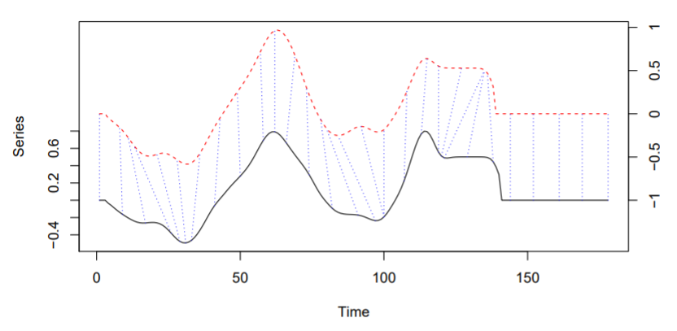

To compute DTW, the local cost matrix $lcm$ is first created, with $x$ and $y$ as the input series, for each element $i$, and $j$. $l_p$ norm between $x_i$ and $y_j$ is also computed, and $p$ corresponds to the $l_p$ norm. 

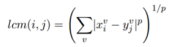

Secondly, the algorithm finds the path that minimises the total cost of $lcm$ by iterating through different pairs of points in the two series. The points in the optimum path are signified using the set $\phi$. The distance is equivalent to the sum of all weight in the optimum path ($m_\phi$), normalised by the constant $M_\phi$

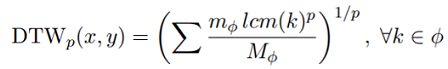

The Shiny app also allows the users to choose several variations of DTW, including:

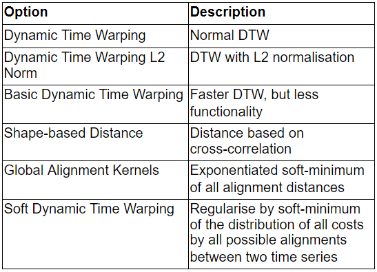

### CLUSTERING TYPE
Several clustering types can be performed using the distance metrics, including hierarchical, partitional, and fuzzy clustering. In hierarchical clustering,  two closest items or clusters are merged repeatedly until only one cluster is left. Meanwhile, for partitional, the cluster size must be determined first and a centroid is initialised for each cluster, then items are assigned to the closest centroid. The centroid will be recalculated and items reassigned to the closest centroids until the results are stable [@lzp_2019_what]. Fuzzy clustering is a soft version of partitional clustering, with probability of belonging to a certain cluster being assigned to each item [@sardaespinosa_2019_timeseries]

### CENTROIDS
Centroid is the central point of each dimension of each cluster, which means it is also a time series. Centroids affect how the items are assigned to the clusters. Available options in the Shiny app are:

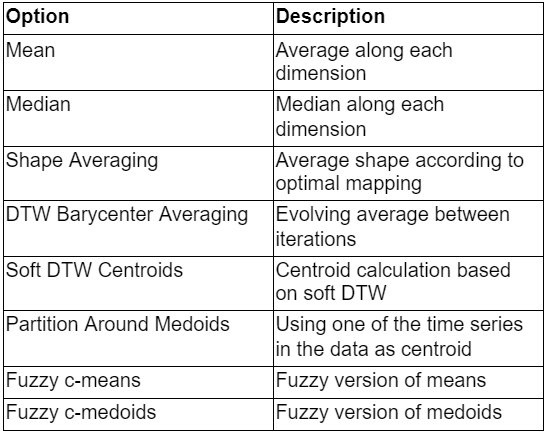

### CLUSTER SIZE
Cluster size is one of the inputs required to do clustering, but the optimum number of clusters is rarely known beforehand because it is an unsupervised technique. To aid in determining the optimum number of clusters, visual analytics is used. For hierarchical clustering, cluster dendrogram can be used to evaluate the distance between and within the clusters, so the users can choose an optimum point to cut the tree.

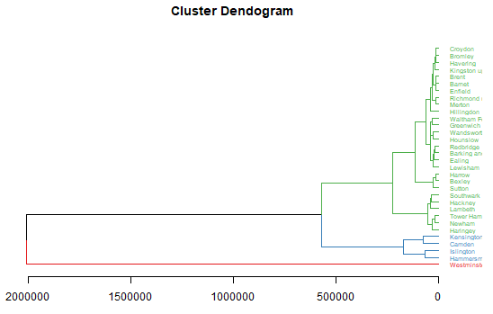

Cluster Validity Indices (CVIs) are evaluation metrics to determine the purity or correctness of the clusters if ground truth is known [@sardaespinosa_2019_package]. Using a plot to visualise the metrics for different numbers of clusters, the users can easily update the number of clusters to their choice. Silhouette coefficient is used for partitional, which is to be maximised. Meanwhile, modified partition coefficient (MPC) is used for fuzzy clustering, in which higher values also correspond to better cluster purity.

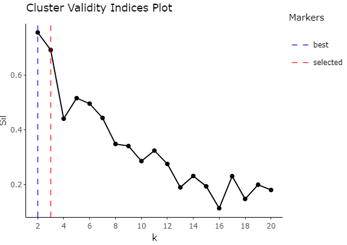

## GEOGRAPHICALLY WEIGHTED REGRESSION
Geographically weighted regression (GWR) is used to explore spatial heterogeneity in the relationship between variables and can be found within the GWmodel R packages. A GWmodel is applicable for use cases where spatial data are not well described by the global form and for some regions, the localised fit provides a better description [@GW_model]. 

A linear regression model utilises spatial data as a stationary process whereby the same model applies across the entire study area [@GWR_handbook].  On the other hand, GWR incorporates the output and predictive variables of each region that fall within the neighbourhood of each target region. A matrix of weights specific to each region where regions nearer to the target region are given greater weight than regions further [@GWR_handbook]. As such, the parameters estimates are local to each region, instead of a global constant across the study area.

There are several factors involved in building a GWR model [@kam_GWR]. They are i) bandwidth, ii) kernel used and lastly iii) p, which is the power of the Minkoswki distance.

### BANDWIDTH
Bandwidth is the distance(in metres) or the number of neighbours used for each local regression model. It can be either calculated as a fixed distance or adaptive based on the number of nearest neighbors. Bandwidth can be calculated using the gwr.bw function in the GWmodel R packages.

The adaptive bandwidth option adapts the number of neighbours required based on the density of the study area whereas a fixed bandwidth stays constant across each region in the study area. Depending on the make-up of the study area, an adaptive bandwidth is useful for study areas with uneven density in regions [@pitfall].  Bandwidths can be calculated via 2 approaches to determine the stopping rule: Cross-validation (CV) approach and Akaike Information Criterion corrected (AICc) approach.

The Shiny application allows users to choose between fixed and adaptive bandwidth and the 2 approaches. 

### KERNEL
Besides bandwidth, the kernel selection also influences the weighing matrix. The weights are determined using a kernel, which is a distance decay function that determines how quickly weight decreases as distance increases. 

The Shiny application allows users to choose between the following kernels: Gaussian, Exponential, 
Bisquare, Tricube and Boxcar. The functions are as followed:

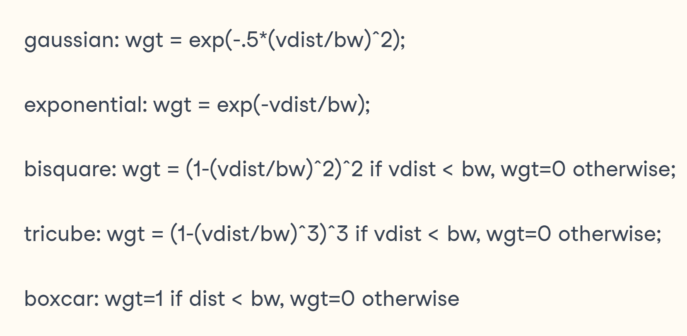

### MINKOWSKI DISTANCE
Distance is calculated using the Minkowski distance - $p$ and there are 2 options - Euclidean distance with p=2 and Manhattan distance with $p$ = 1. 

### TYPES OF GWMODEL
In the GWmodel package, it includes a variety of modeling methods, including gw.basic, gw.mixed and gtwr. This Shiny application allows users to explore the differences between the parameter estimates of a gw.basic and a gw.mixed model. 

A gw.basic model is the basic model found in the GWmodel packages. On the other hand, a gw.mixed model implements a mixture of semi-parametric variables. This allows some predictor variables in the formula to be treated as global, instead of local. 

In this Shiny application, users are able to select a variable to be treated as global and compare the difference in the parameter coefficients results. Typically, using gwss in the GWmodel package, the Monte Carlo approach can test for significant spatial variation in each coefficient based on the basic GW model [@lu2013gwmodel]

The Monte Carlo approach is out of scope in this Shiny application and to be included as part of future works.

### OTHER PACKAGES
There are alternative packages utilised for geographically weighted regression, such as the spgwr, gwrr and McSpatial packages. The functions of these packages are similar to GWmodel. 

An advantage of GWmodel is the ability to provide 5 kernel functions, whereas spgwr can only provide 3. In terms of GW summary statistics, it provides a robust statistics summary with median, inter-quartile  and range [@GW_model]

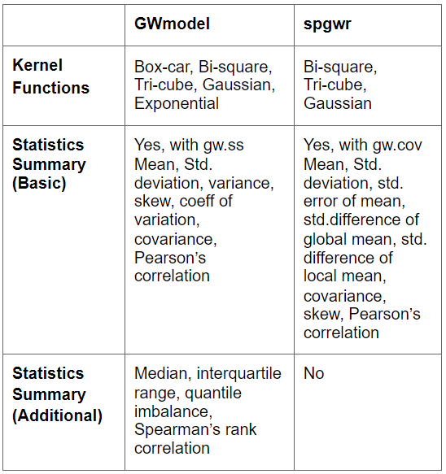

# DISCUSSIONS
## ESDA 
The map plot for the pristine crime rate shows that the Westminster area has the highest crime rate.

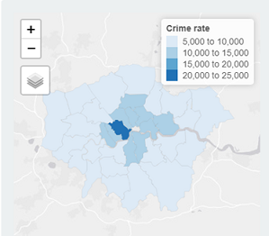

Nonetheless, when Moran’s I and Gi statistics were compared, it became visually clear that the spatial clusters and outliers are quite different from the raw data; the Gi statistics is able to show the “hot” and “cold” spots of crimes while Moran’s I shows the local outliers.

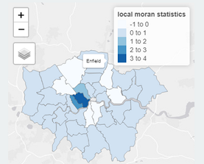
<!-- \begin{figure}[h] -->
<!--     \centering -->
<!--     \includegraphics[width=0.47\textwidth]{Images/moran_map2.png} -->
<!--     \caption{Moran's I value spatial plot of crime rate per 100,000 residents in London} -->
<!--     \label{fig:mesh8} -->
<!-- \end{figure} -->
<!-- \ -->
<!-- \begin{figure}[h] -->
<!--     \centering -->
<!--     \includegraphics[width=0.47\textwidth]{Images/GI_map.png} -->
<!--     \caption{Gi value spatial plot of crime rate per 100,000 residents in London} -->
<!--     \label{fig:mesh9} -->
<!-- \end{figure} -->

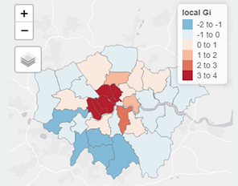

## CLUSTERING
To examine the geospatial proximities of cluster members, a map filled with different colours for each cluster assignment is used. For partitional clustering of Theft and Handling crimes using basic DTW distance metrics and partition around medoids as the centroid, the cluster assignment seems to be correlated with the boroughs’ geospatial location. Cluster 1 and 2 is in the center of London, with Cluster 2 in the west side of London City. Meanwhile, Cluster 3 is in the outskirts area.

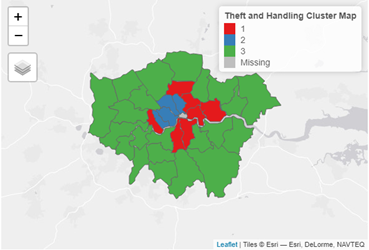

The time series of the data can be used to describe the characteristics of each cluster. It is faceted by the cluster assignment to provide clear separation between the clusters. Cluster 2 has the highest crime rate, with a decreasing trend from 2012 that reverted in 2016. Cluster 1 and 3 have a relatively flat trend, but Cluster 1 has a higher crime rate than Cluster 3.

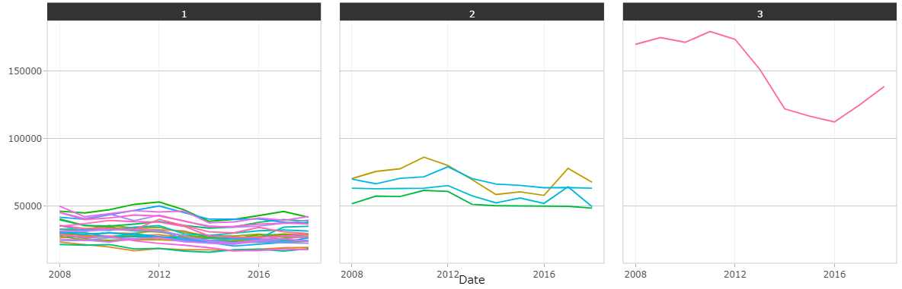

## GEOGRAPHICALLY WEIGHTED REGRESSION
For 2017 crime rate on theft and handling, the 3 variables - population density, unemployment of White UK citizens and mean income are able to explain 62% of the crime rate across the 32 boroughs. 

The boroughs with the top 20% percentile in crime rate are neighbours while boroughs with the bottom 20% of crime rate are concentrated mainly in the south.

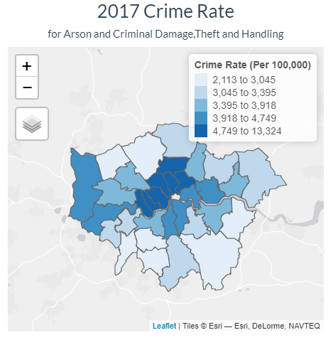

An initial investigation will be visualising the residual of the linear model through a choropleth. Boroughs with over-prediction (negative residuals) are neighbouring boroughs, suggesting a possibility of spatial patterning [@medina]. Moran ‘s I test rejected the null hypothesis that the residuals are randomly distributed.

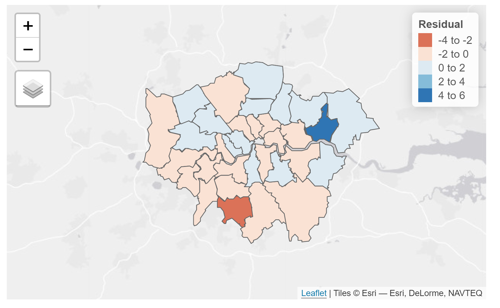

With the GWmodel, R2 has improved slightly from 62% to 62.7%, showing that the localised model  is able to explain crime data better.

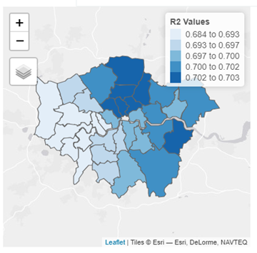

# FUTURE WORKS
For geographically weighted regression, the lack of ward level data points, including population, limits the availability of crime rate data. In future, GWR modeling should be performed on the ward level once demographics datasets are available on the ward level. The gwss function can be further explored to understand the statistical significance of each variable on the local level.

The clustering can be improved by applying smoothing on the crime rate. Even though the rate has been normalised with the population, some boroughs still have significantly higher crime rates than others. Empirical Bayes smoothing technique that is used in the ESDA portion could be used as a preprocessing function to smoothen the outliers before clustering. Additionally, comparison with other packages such as spatimeclus or tsclust can be performed. 

# ACKNOWLEDGMENTS
The authors would like to thank Professor Kam Tin Seong of Singapore Management University for his valuable advice and support on this project. 

# References

---
references:
- id: hunt2019
  title: 'From Crime Mapping to Crime Forecasting: The Evolution of Place-Based Policing'
  author:
  - family: Hunt
    given: Joel
  volume: 1
  URL: 'https://nij.ojp.gov/topics/articles/crime-mapping-crime-forecasting-evolution-place-based-policing'
  issue: 281
  publisher: National Institute of Justice
  type: article-journal
  issued:
    year: 2019
    month: 4
- id: santos_2017_crime
  title: Crime analysis with crime mapping
  author:
  - family: Santos
    given: Rachel Boba
  URL: '{https://www.sagepub.com/sites/default/files/upm-binaries/46973_CH_1.pdf'
  publisher: Sage Publications, Inc
  type: book
  issued:
    year: 2016
    month: 11
- id: sardaespinosa_2019_timeseries
  title: From Crime Mapping to Crime Forecasting, The Evolution of Place-Based Policing
  author:
  - family: Sardá-Espinosa
    given: Alexis
  volume: 11
  URL: 'https://cran.r-project.org/web/packages/dtwclust/vignettes/dtwclust.pdf'
  type: The R Journal
  issued:
    year: 2019
- id: wang_2007_on
  title: On fuzzy cluster validity indices
  journal: Fuzzy Sets and Systems
  author:
  - family: Wang 
    given: Weina 
  - family: Zhang
    given: Yunjie
  volume: 158
  URL: 'https://www.sciencedirect.com/science/article/pii/S0165011407001133'
  DOI: https://doi.org/10.1016/j.fss.2007.03.004
  issue: 19
  page: 2095-2117
  publisher: Elsevier B.V.
  type: article-journal
  issued:
    year: 2007
    month: 10
- id: sardaespinosa_2019_package
  title: Package 'dtwclust'
  author:
  - family: Sardá-Espinosa
    given: Alexis
  volume: 11
  URL: 'https://cran.r-project.org/web/packages/dtwclust/dtwclust.pdf'
  type: R Documentation
  issued:
    year: 2019
- id: GWR_handbook
  title: Geographically weighted regression
  book: The Sage handbook of spatial analysis
  author:
  - family: Fotheringham 
    given: A Stewart  
  - family: Rogerson
    given: Peter A 
  URL: 'https://nij.ojp.gov/topics/articles/crime-mapping-crime-forecasting-evolution-place-based-policing'
  page: 243-254
  publisher: Sage Publications, Inc
  type: book
  issued:
    year: 2009
- id: GW_model
  title: 'GWmodel: an R package for exploring spatial heterogeneity'
  journal: Journal of Statistical Software
  author:
  - family: Gollini 
    given: Isabella  
  - family: Lu
    given: Binbin
  - family: Charlton
    given: Martin 
  - family: Brunsdon
    given: Christopher
  - family: Harris
    given: Paul  
  URL: 'https://www.jstatsoft.org/article/view/v063i17'
  DOI: 10.18637/jss.v063.i17
  volume: 63
  issue: 17
  page: 1-50
  type: article-journal
  issued:
    year: 2015
    month: 2
- id: lu2013gwmodel
  title: 'The GWmodel R package: Further Topics for Exploring Spatial Heterogeneity using Geographically Weighted Models'
  journal: Journal of Statistical Software
  author:
  - family: Lu
    given: Binbin
  - family: Harris
    given: Paul  
  - family: Charlton
    given: Martin 
  - family: Brunsdon
    given: Christopher
  URL: 'https://arxiv.org/abs/1312.2753'
  type: stat.ME
  issued:
    year: 2013
- id: kam_GWR
  title: 'Hands-on Exercise 9: Building Hedonic Pricing Model with GWR Method'
  author:
  - family: Kam
    given: Tin Seong
  container-title: Exer9
  URL: 'https://rpubs.com/tskam/IS415-Hands-on_Ex09'
  type: R.Pub
  issued:
    year: 2019
    month: 3
- id: pitfall
  title: 'Considerations and Pitfalls in the Spatial Analysis of Water Quality Data and Its Association With Hydraulic Fracturing'
  author:
  - family: Meik
    given: Jesse
  - family: Lawing
    given: Michelle
  URL: 'https://www.researchgate.net/publication/320367060_Considerations_and_Pitfalls_in_the_Spatial_Analysis_of_Water_Quality_Data_and_Its_Association_With_Hydraulic_Fracturing'
  DOI: 10.1016/bs.apmp.2017.08.013
  vol: 1
  page: 227-256
  type: article-journal
  issued:
    year: 2017
    month: 1
- id: ESDA_D
  title: 'Exploratory Spatial Data Analysis'
  author:
  - family: Dall’erba
    given: S
  container-title: International Encyclopedia of Human Geography
  URL: 'https://www.sciencedirect.com/science/article/pii/B9780080449104004338'
  DOI: 10.1016/B978-008044910-4.00433-8
  journal: International Encyclopedia of Human Geography
  publisher: Elsevier
  page: 683-690
  type: article-journal
  issued:
    year: 2009
    month: 7
- id: LISA
  title: 'Local Indicators of Spatial Association—LISA'
  author:
  - family: Anselin
    given: Luc
  URL: 'https://onlinelibrary.wiley.com/doi/abs/10.1111/j.1538-4632.1995.tb00338.x'
  DOI: https://doi.org/10.1111/j.1538-4632.1995.tb00338.x
  journal: Geographical Analysis
  vol: 27
  page: 93-115
  type: article-journal
  issued:
    year: 1995
    month: 4
- id: MORAN
  title: 'Moran’s Autocorrelation Coefficient in Comparative Methods'
  author:
  - family:  Paradis
    given: Emmanuel
  URL: 'https://cran.r-project.org/web/packages/ape/vignettes/MoranI.pdf'
  DOI: https://doi.org/10.1111/j.1538-4632.1995.tb00338.x
  type: R package document
  issued:
    year: 2020
    month: 8
- id: Gi_statistics
  title: 'How Hot Spot Analysis (Getis-Ord Gi*) works'
  author: 'ArcGis Pro'
  URL: 'https://pro.arcgis.com/en/pro-app/latest/tool-reference/spatial-statistics/h-how-hot-spot-analysis-getis-ord-gi-spatial-stati.htm'
  type: website
  publisher: Esri software
  extracted:
    year: 2021
    month: 4
- id: SENIOR
  title: 'Simple Geo-Spatial Analysis using R-Shiny'
  author:
  - family: Li
    given: Junyi Darren
  - Muhammad Jufri Bin Ramli
  - family: Teo
    given: Lip Peng Raymond
  URL: 'https://wiki.smu.edu.sg/1920t2isss608/Group11_proposal'
  type: web-wiki
  issued:
    year: 2020
- id: Meijer
  title: 'Predictive Policing: Review of Benefits and Drawbacks'
  author:
  - family: Meijer
    given: Albert
  - family: Wessels
    given: Martijn    
  container-title: International Journal of Public Administration
  URL: 'https://www.tandfonline.com/doi/pdf/10.1080/01900692.2019.1575664?needAccess=true&'
  DOI: 10.1080/01900692.2019.1575664
  journal: International Journal of Public Administration
  publisher: Elsevier
  volume: 42
  issue: 12
  page: 1031-1039 
  type: article-journal
  issued:
    year: 2019
    month: 2
- id: RAND
  title: 'Predictive Policing'
  author:
  - RAND Corporation   
  URL: 'https://www.rand.org/content/dam/rand/pubs/research_briefs/RB9700/RB9735/RAND_RB9735.pdf'
  publisher: RAND Corporation 
  type: research brief
  issued:
    year: 2014
- id: lzp_2019_what
  title: 'What Is the Difference Between Hierarchical and Partitional clustering?'
  author:
  - family: Jason
    given: LZP
  URL: 'https://lzpdatascience.medium.com/what-is-the-difference-between-hierarchical-and-partitional-clustering-edc0d488c7c4#:~:text=An%20example%20of%20Hierarchical%20clustering,distance%20of%20the%20clusters%20shifts.'
  publisher: Medium
  issued:
    year: 2019
    month: 2 
  urldate: 2021-04-24
- id: medina
  title: 'Crime Mapping in R'
  author:
  - family: Medina
    given: J
  - family: Solymosi
    given: R
  URL: 'hhttps://github.com/maczokni/crimemapping_textbook_bookdown/'
  publisher: Medium
  issued:
    year: 2019
    month: 4

...

