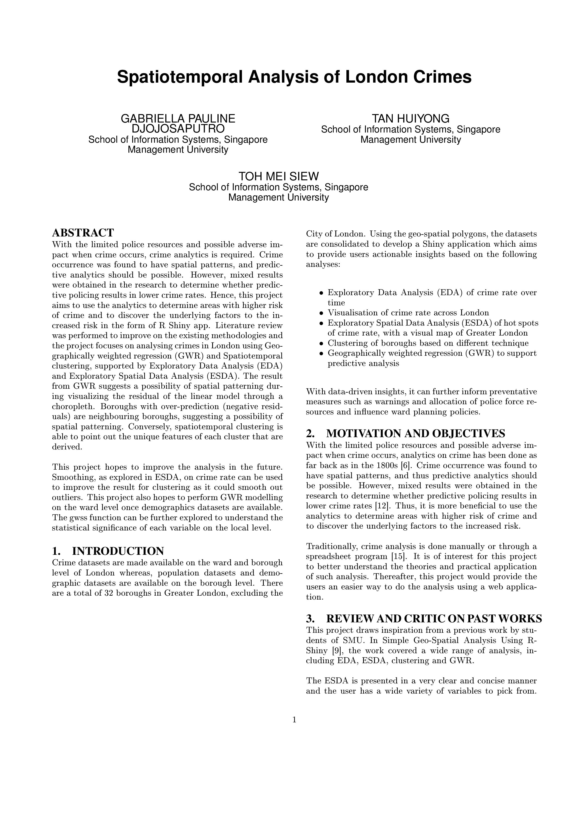
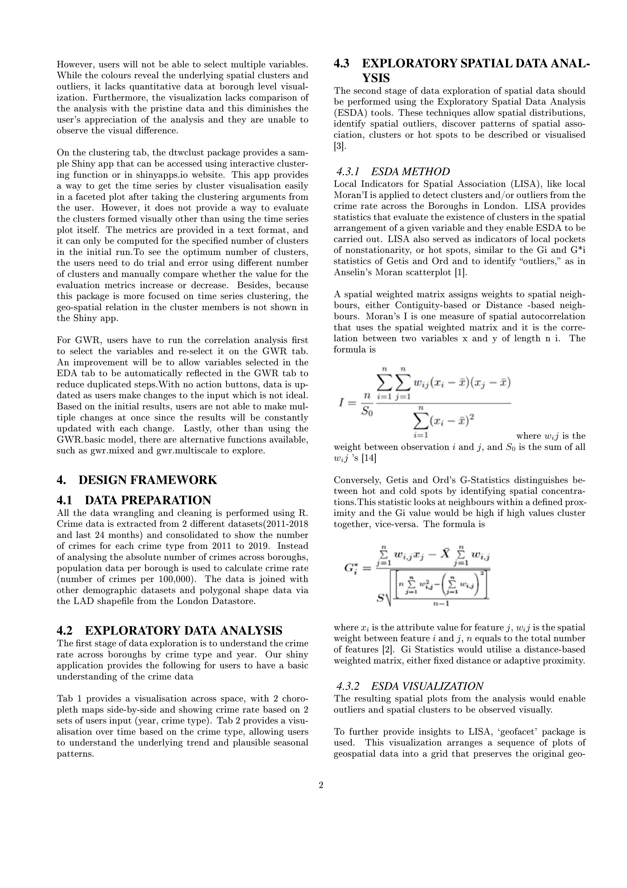
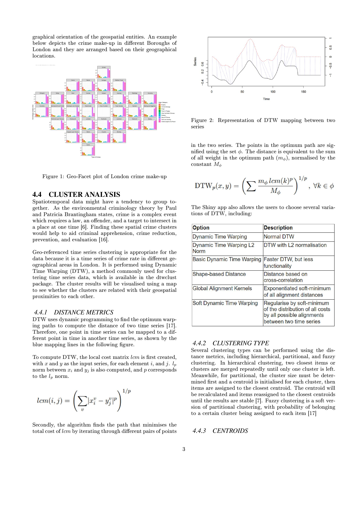
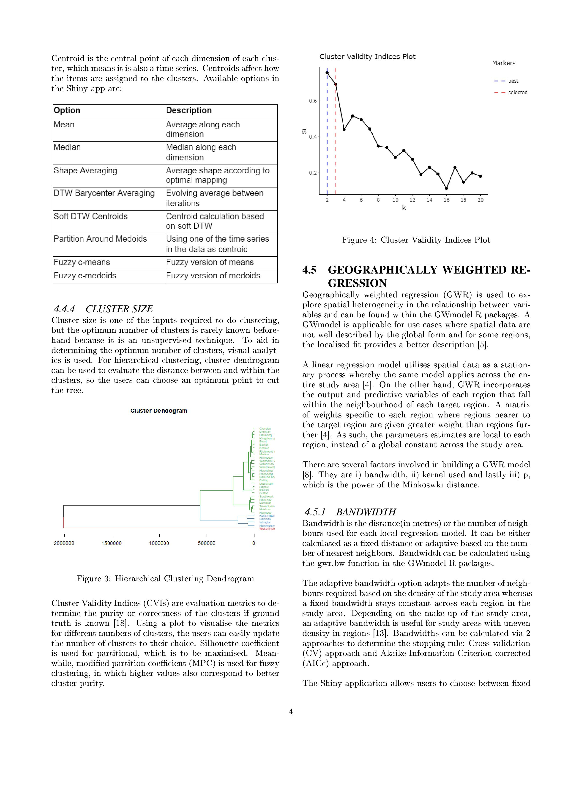
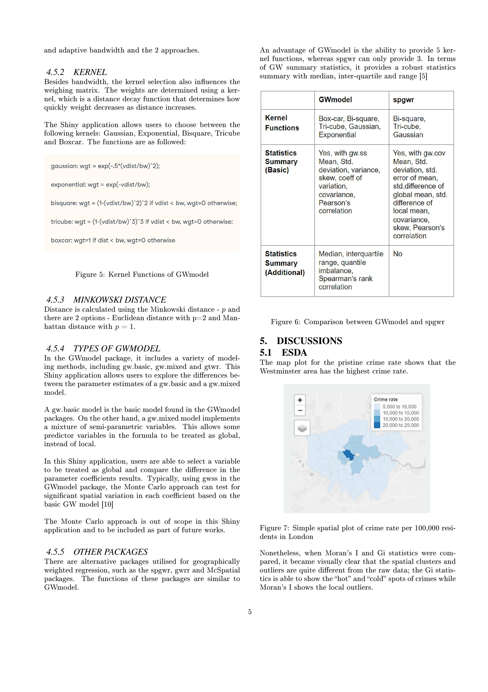
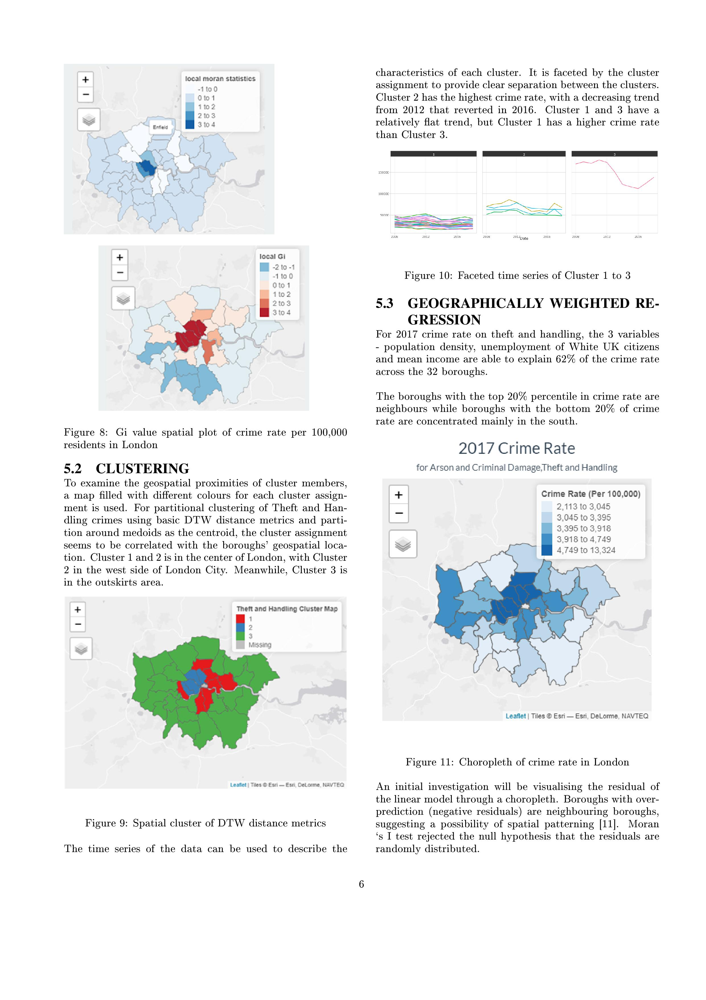
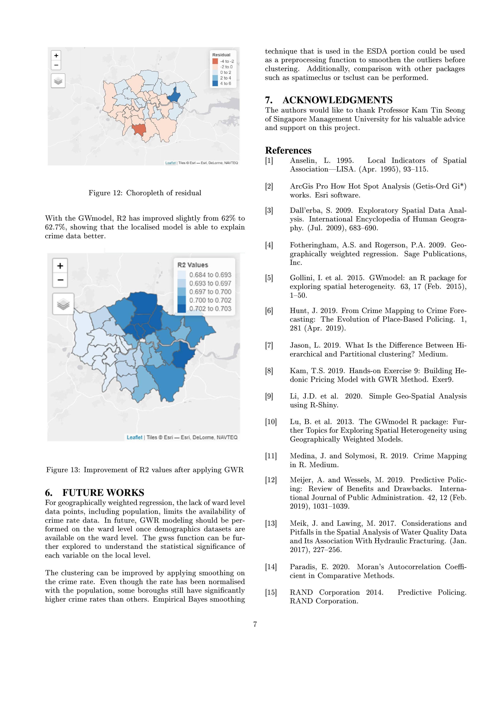
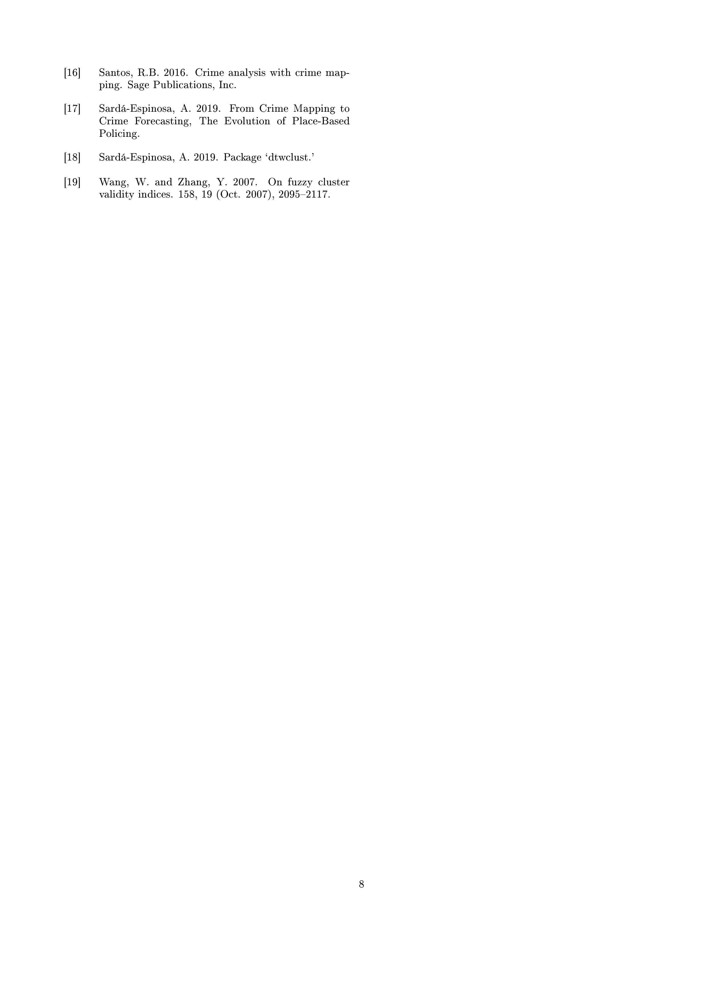

```{r setup, include=FALSE}
knitr::opts_chunk$set(echo = FALSE)
```

The research paper is appended below.

```{r}
rmarkdown::render("./SpatiotemporalAnalysis/SpatiotemporalAnalysis.rmd",
                  output_file = "SpatiotemporalAnalysis/SpatiotemporalAnalysis_test.pdf")
```
\includepdf[pages={1}]{SpatiotemporalAnalysis/SpatiotemporalAnalysis.pdf}


















