```{r setup, include=FALSE}
knitr::opts_chunk$set(echo = FALSE)
```

# 1. The Prime Crime Area Spatiotemporal Analysis 
--> Insert Abstract

# 2. Exploratory Data Analysis (EDA)
This tab helps the user to explore the distribution data across space and across time. 

1. Select the year of interest and the types of crime that should be included in the crime rate count.
2. If "Compare Crime Rate" option is selected, the users will be given a second selection input for the year and crime type.

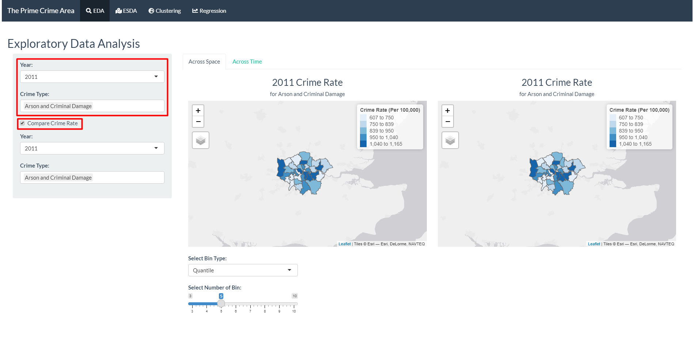

3. The first selection will be shown on the left, while the second selection for comparison is shown in the map on the right. The map shows the distribution of the crime rate in across the boroughs, with darker colour showing a higher crime rate.
4. The users can adjust the colour scale by selecting the bin type (Quantile or Pretty) and the number of bins.
5. Hovering over the map will reveal the name of the borough.

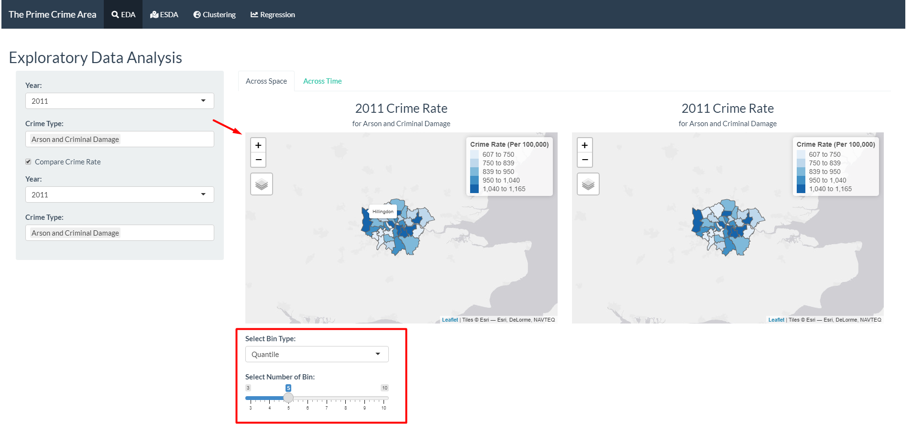

6. Move to the "Across Time" tab to see the breakdown of the trend, seasonality, and randomness in the crime rate time series.

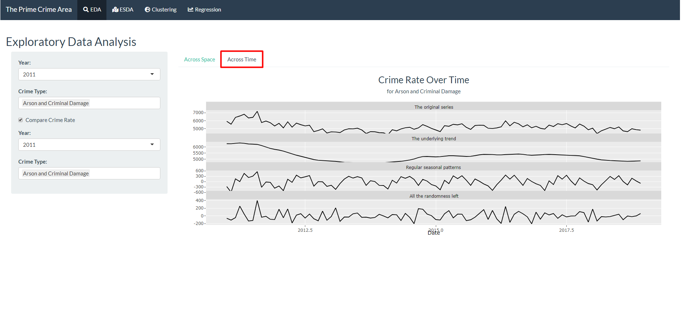

# 3. Exploratory Spatial Data Analysis (ESDA)
This tab helps the user to the spatial exploration of the data, using Local Indicator for Spatial Association (LISA) and Geospatial Facet. These techniques allow identification of spatial distributions, spatial outliers, patterns of spatial association, and clusters or hot spots to be described or visualised.

There are two parts of the input:
   * Data: To select what years and crime types will be included in the data for LISA and geospatial facet computation.
   * ESDA: To select parameters to be used in the computation for LISA, including the reference value and bin type.
   
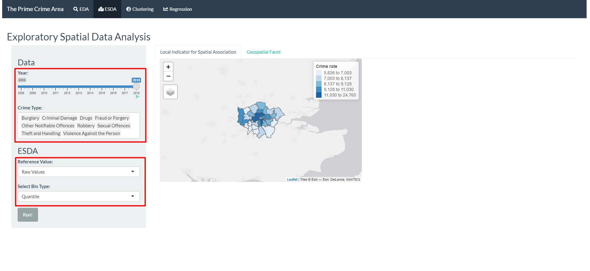
   
1. Select the years and crime types. 
2. Select the reference value to be used. Options: 

Reference Value | Description
----------------|--------------
Raw values | Pristine Crime rate per 100,000 population. Several color styles have been loaded.
Local Moran's I | A type of Local Indicators of Spatial Association (LISA) that evaluate the existence of clusters in the spatial arrangement of a given variable. It uses contiguity-based neighbours to derive the spatial weight matrix.
Empirical Bayesian | Rates  tend to have intrinsic variance instability, which may lead to the identification of spurious outliers. Smoothing approaches is used to correct this effect.
Getis and Ord’s G-Statistics (Gi Fixed and Gi Adaptive) | For detection of hot and cold spots. It uses distance-based (either fixed on adaptive)  neighbours to derive the spatial weight matrix.

3. Select additional parameters required, depending of the reference values chosen. 

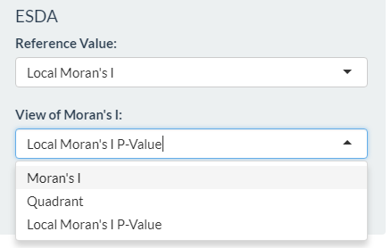{width=50%}

4. Click "Run!" and the results is shown in the map.

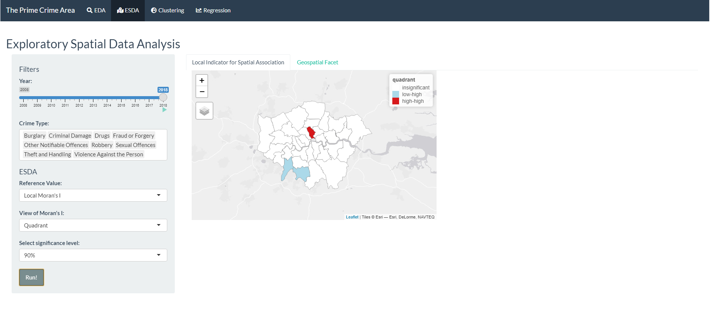

5. Go to Geospatial Facet to see the bar plots by crime type, faceted and arranged by the geospatial area.

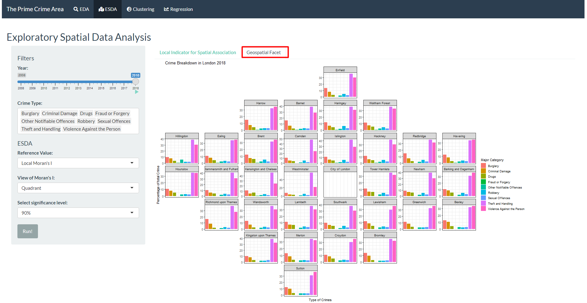

6. In both LISA and Geospatial Facet, the animate function can be used. It will iterate through the years in 4 seconds interval automatically.

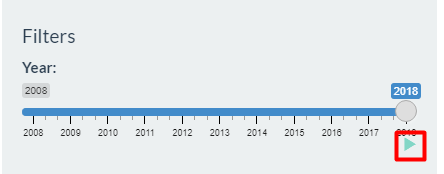

# 4. Geo-referenced Time Series Clustering 
As the data have both spatial and temporal aspects, the series will be clustered using dynamic time warping first, then visualised in a map to examine the spatial distribution of the clusters.


There are two parts of the input:

   * Data: To select what years and which crime type will be used in the data for clustering, and whether the data should be preprocessed using zscore function.
   * Clustering: To select parameters to be used in the computation for clustering, including the distance metrics, clustering type, and centroids.
   
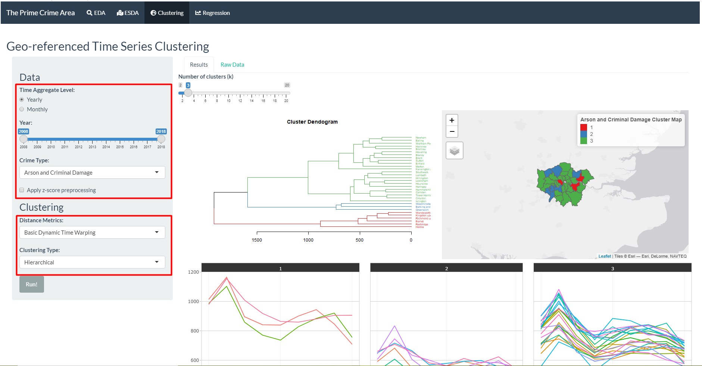
   
1. Select the years and crime type of data that is going to be used for the clustering.

2. Select the distance metrics to examine similarity between boroughs. Options:

Distance Metrics | Description
-----------------|-------------
Dynamic Time Warping | Normal DTW
Dynamic Time Warping L2 Norm | DTW with L2 normalisation
Basic Dynamic Time Warping | Faster DTW, but less functionality
Shape-based Distance | Distance based on cross-correlation
Global Alignment Kernels | Exponentiated soft-minimum of all alignment distances
Soft Dynamic Time Warping | Regularise by soft-minimum of the distribution of all costs by all possible alignments between two time series

3. Select the clustering type. Options:

Clustering Type | Description
----------------|--------------
Hierarchical | Merge two closest items repeatedly until only one cluster is left
Partitional | Assign items to cluster with closest centroids, then recalculate centroids and reassign items until the results are stabl
Fuzzy | Soft partitional clustering that assigns probability of belongingness to every clusters

4. Select centroids calculation to be used the clustering function. Centroid only need to be given if partitional or fuzzy clustering type is selected. The list of available options are as the following: 

Centroids | Description
----------|----------------
Mean | Average along each dimension
Median | Median along each dimension
Shape Averaging  | Average shape according to optimal mapping
DTW Barycenter Averaging | Evolving average between iterations
Soft DTW Centroids | Centroid calculation based on soft DTW
Partition Around Medoids | Using one of the time series in the data as centroid
Fuzzy c-means | Fuzzy version of means
Fuzzy c-medoids | Fuzzy version of medoids

5. Click "Run!" and the results will be shown in the main panel. For hierarchical clustering, cluster dendrogram will be shown. For partitional and fuzzy clustering, cluster validity indices plot will be shown. 

6. Number of clusters can be toggled, the visualisation will follow the new cluster assignment based on the number of clusters selected. 

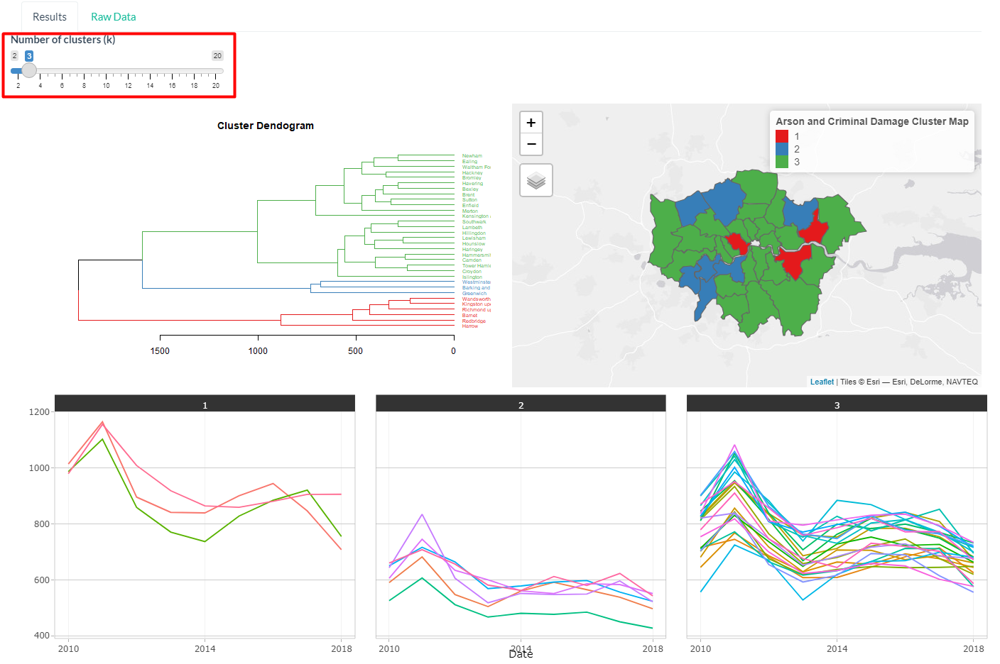
   
7. The user can hover over the time series to reveal which borough the series belong to and the crime rate at the point of time. 

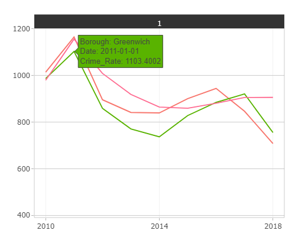

8. Hovering over the cluster validity indices plot will also reveal the value of the metric for the number of cluster.

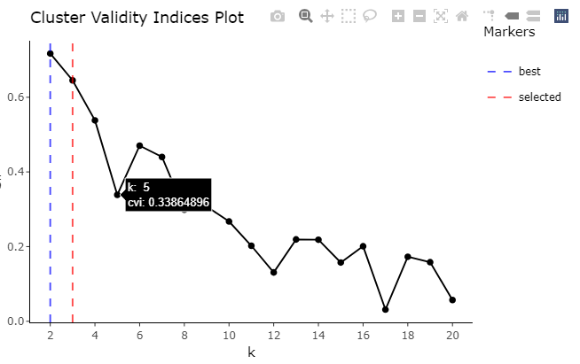

9. Go to Raw Data to see the occurence of crime, population, and crime rate. 

10. Click on the column header to sort the data. Click twice to change between ascending and descending order.

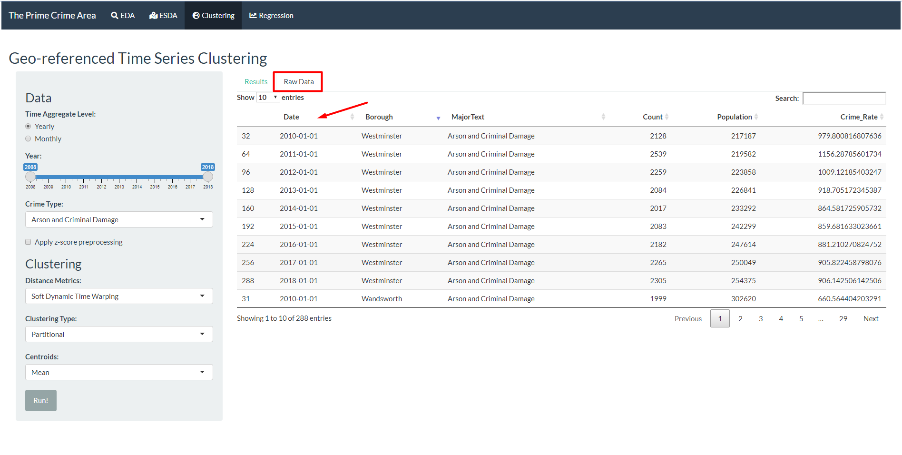

# 5. Geographically Weighted Regression (GWR)
This tab  is used to find variables that explains the target variable - crime rate of each boroughs in London - and explore spatial heterogeneity in the relationship between variables. 

There are two parts of the input:

   * Data: To select what year, input variables, and crime types will be used in the data for GWR. Additionally, the users can choose to show the correlation analysis to help in the process of choosing the input variables.
   * GWR: To select parameters to be used in the computation for GWR, including the kernel, approach, bandwidth, and Minkowski distance.
   
1. Select the year, input variables, and crime types to be used.

2. Check "Show Correlation Analysis" and click "Run!". Ensure that there are more than 1 variables being selected, otherwise there will be no correlation plot generated.

3. Go to the "Parameters Correlation" sub-tab to view the correlation between selected variables. Highly correlated variables should not be used in the regression model. For example, since the value of Mean_Income_2011 is highly correlated to Medium_Income_2011, only of the two should be used but not both.

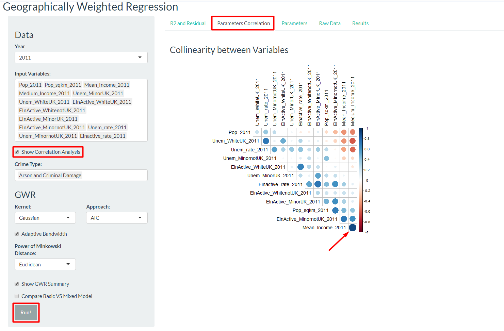
   
4. Refine the input variables chosen for the model.

5. Select the kernel to be used. Kernel is a distance decay function that determines how quickly weight decreases as distance increases. The figure below shows the formula for different kernel options in the Shiny app. 


6. Select approach to calculate bandwidth, which is the  distance(in metres) or the number of neighbours used for each local regression model. Available options are Cross-validation (CV) approach and Akaike Information Criterion corrected (AICc) approach.


7. Select adaptive bandwidth or provide manual input for the bandwidth.

8. Select Power of Minkowski distance. The options are Euclidean distance with p=2 and Manhattan distance with p = 1. 

9. The user can select "Show GWR Summary" and/or "Compare Basic VS Mixed Model" if they desire more thorough information. 

10. Several visualisation is used to examine the results of GWR. R2 and residual defines how well the input variables explain the target variable. The map shows how the explanatory power might be stronger in some region than the others. The users can select the bin type and number of bin for the colour scale.

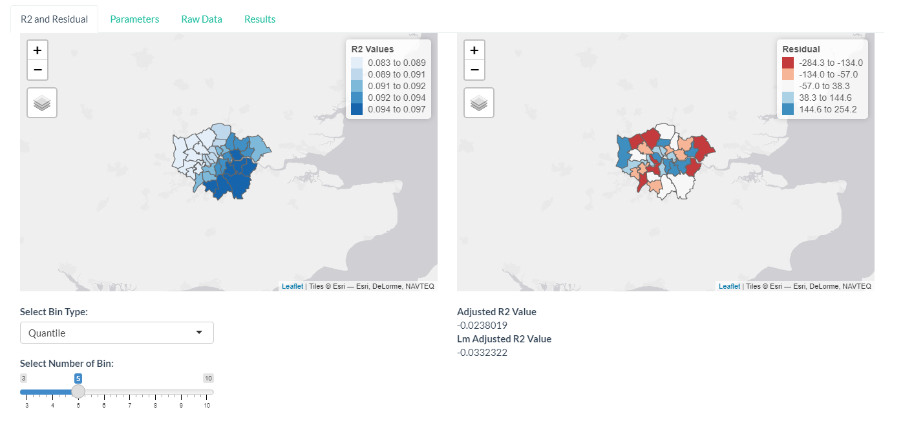

11. Parameters sub-tab will show the coefficient and p-value of the regression, also visualised in maps. If the option to compare with mixed model is selected, it will also be shown here.

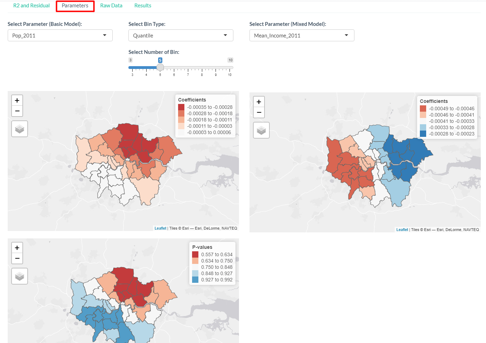

12. As in the Clustering tab, the raw data is available for viewing.

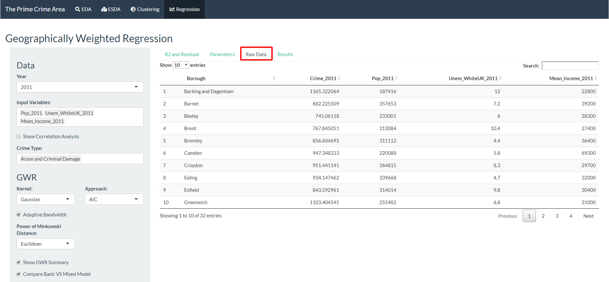

13. If the choice to show GWR summary is selected, then the text output from the GWmodel package will be shown in the Results sub-tab.

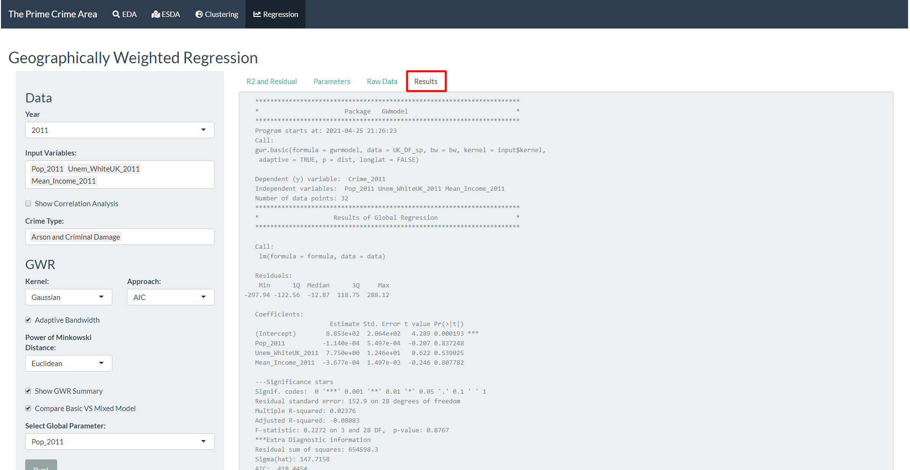
