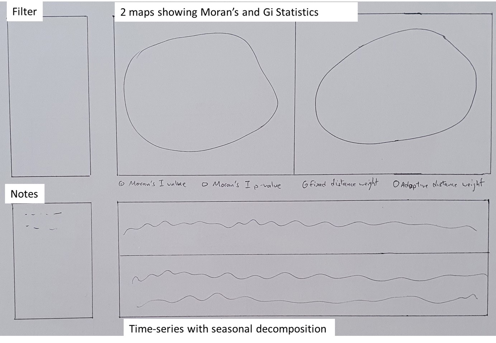
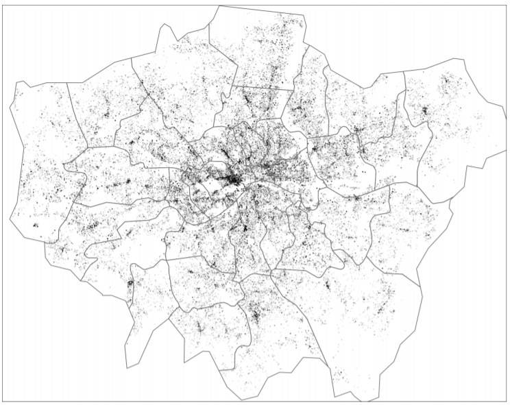
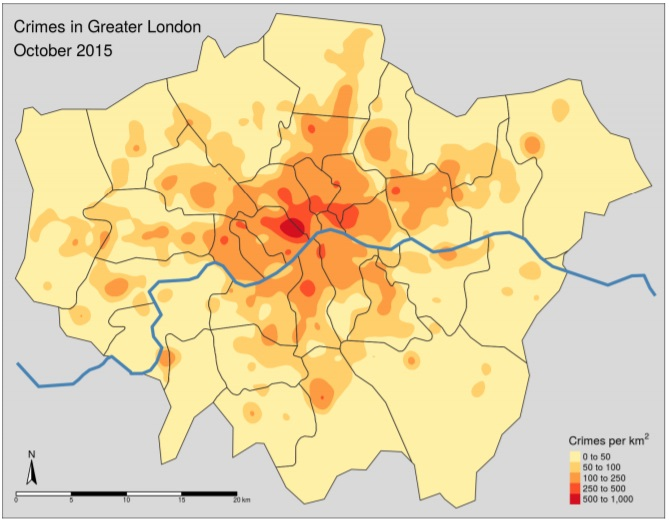
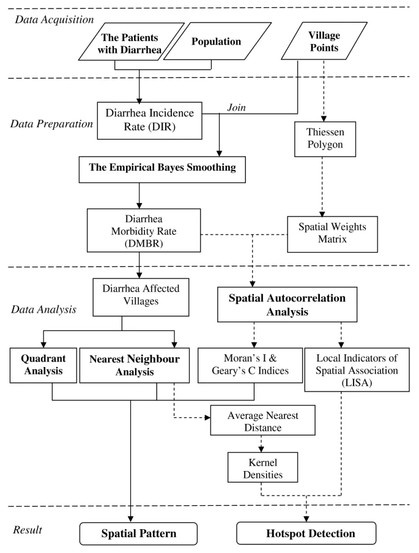
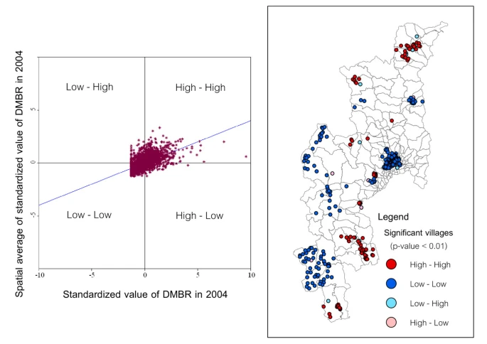

---
output: html_document
---

<style>
img {
    max-width: none;

    /* other options:
    max-width: 1200px;
    */
}
</style>

```{r setup, include=FALSE}
knitr::opts_chunk$set(echo = TRUE, warning=FALSE, message=TRUE, background = "bg-danger")
options(width = 80)
```

## Objective
There is a growing emphasis on crime analysis by law enforcement agencies over the past decades. Crime analysis is defined as the systematic study of crime and disorder problems as well as other police-related issues—including socio-demographic, spatial, and temporal factors—to assist the police in criminal apprehension, crime and disorder reduction, crime prevention, and evaluation ([Santos, 2016)](https://www.sagepub.com/sites/default/files/upm-binaries/46973_CH_1.pdf). 

A literature review will be conducted to understand the how analysis of crime data was done before. Thereafter,This article will analyse historical crimes in Greater London, UK, particularly using the hot-spots and spatial clustering methods to give insights on the crime in the metropolitan.

The analysis will be presented in the form of visualization and they will be part of the Shiny-App dashboard in the future.

## 1. Storyboard

The storyboard will depict the EDA module of the ShinyApp and it would consists of filter panel, geo-spatial visualization and time series of crimes.

{width=100%}

It is important to show visualize the EDA in geo-spatial format as the data touches on crimes within a city and it would be difficult to view the difference in crimes across the city if a crosstab was used to display it.

The time series line plot would allow one to observe any trends over time. 

A filter panel is essential to maximise interactivity. However, this will be explored during the coding of the ShinyApp.

## 2. Literature review

There are different methods in displaying geo-spatial data. Based on studies by [Tennekes, M.](https://www.jstatsoft.org/article/view/v084i06/v84i06.pdf), tmap R package provides a wide range of plotting methods for users. If the exact locations of each crime is known, they could be plotted as a dot map.

{width=90%}

Tennekes had demonstrated that the **smooth_map** function with the package could visualize crime density by area in a smoothed density contoured lines and spatial polygons that represent areas with uniform density value,

{width=90%}

While the Kernel density map for the crime is able to show area with high density of crimes per area, it does not partake any spatial autocorrection analysis to visualize spatial pattern or hotspot detection. [Chaikaew, Tripathi & Souris](https://ij-healthgeographics.biomedcentral.com/articles/10.1186/1476-072X-8-36) had written an article on "Exploring spatial patterns and hotspots of diarrhea in Chiang Mai, Thailand" and they had applied an drew up an flowchart to depict how they devise their analysis.

{width=80%}

They have utilized  local Moran statistics and locations by type of association (LISA cluster map) to indicate spatial clusters. On the other hand, they had calculated local spatial correlation indices to display the hotspots. Nonetheless, a multiplicative measure of overall spatial association of values which fall within a given distance of each other, such as Getis and Ord’s G-Statistics could be explored to depict distance based clustering.

{width=100%}

__*Literature Source*__

*Nakarin Chaikaew, Nitin K Tripathi & Marc Souris, Exploring spatial patterns and hotspots of diarrhea in Chiang Mai, Thailand, International Journal of Health Geographics, 24 June 2009*

*Tennekes, M., tmap: Thematic Maps in R, for Journal of Statistical Software, April 2018, Volume 84, Issue 6.*


## 3.  Step-by-step Data Preparation
### 3.1 Installing and launching relevant R packages

```{r, include=FALSE}
packages = c('dplyr','readr','sf',
             'tidyverse', 'ggplot2','lubridate',
             'DCluster','spdep','dygraphs',
             'xts','rgdal', 'rmarkdown', 
             'tmaptools', 'ggseas', 'tmap')
for (p in packages){
  if(!require(p,character.only = T)){
    install.packages(p)
  }
  library(p,character.only = T)
}

```

### 3.2 Datasource

The datasets used in this analysis are taken from London Datastore, which is a data repository created by Greater London Authority (GLA). The datasets for the analysis are as follows:

1. Recorded Crime: Geographic Breakdown
  - Historic crimes from Mar 2010 till Dec 2018
  - Recent 24 months crimes

2. Statistical GIS Boundary Files for London
  - Wards level -  Ward is the primary unit of English electoral geography 
  - Borough level -  Boroughs are local authority districts that make up the ceremonial county of Greater London, with each Borough divided into different wards.

3. Population and housing density of Greater London at Borough level

### 3.3 Importing of crime dataset into R
The dataset are in CSV format, hence **read_csv()** function of __*readr*__ package was used to import the data for both past 24 months and historical ones.

```{r, results='hide'}
crime_his = read_csv('data/MPS_Ward_Level_Crime_Historic_NewWard.csv')
crime_24mths = read_csv('data/MPS Ward Level Crime (most recent 24 months).csv')
```

### 3.4 Understanding the crime data
The structure of the data was examined.

```{r, include=FALSE}
# Limited number of columns was displayed due to large number of columns that represent different month-year of crimes.
glimpse(crime_24mths[1:10])
glimpse(crime_his[1:15])
```

### 3.5 Unpivoting crime dataset
It was observed that the data sets were presented in pivoted format whereby the month year of when the crime had took place are presented as individual columns. **pivot_longer()** function of __*tidyverse*__ was used to "unpivot" the data. A new column "Month_Year" is created to account for the month of the crimes and this column is converted into date using **as.Date()** function. Other columns are renamed for easier reference and to be consistent between the 2 datasets.


```{r}

crime_his_tab = crime_his %>%
  pivot_longer(!c(`Major Category`,
                  `Minor Category`,
                  `Ward Name`,
                  WardCode,
                  Borough),
                  names_to = 'Month_Year', values_to = 'Count') %>%
          rename(`WardName` = `Ward Name`, 
         `Crime_Sub_Category` = `Minor Category`,
         `Crime_Category` = `Major Category`,
         `BoroughName` = `Borough`) %>%
  mutate(Month_Year=as.Date(paste0(Month_Year,'01'), format="%Y%m%d"))

crime_24mths_tab = crime_24mths %>%
  pivot_longer(!c(MajorText,
                  MinorText,
                  WardName,
                  WardCode,
                  LookUp_BoroughName),
                  names_to = 'Month_Year', values_to = 'Count') %>%
          rename(`Crime_Sub_Category` = `MinorText`,
         `Crime_Category` = `MajorText`,
         `BoroughName` = `LookUp_BoroughName`) %>%
  mutate(Month_Year=as.Date(paste0(Month_Year,'01'), format="%Y%m%d"))

glimpse(crime_his_tab)
glimpse(crime_24mths_tab)
```

### 3.6 Comparison of datasets
The unique values of Borough and Ward-Code are studied between the historical and past 24 months crime datasets.It was observed that the names of borough was identical, but not for Ward level, there are 90 wards with different ward codes.

```{r}
sort(unique(crime_his_tab$BoroughName)) == sort(unique(crime_24mths_tab$BoroughName))

compare = tibble(binary = sort(unique(crime_24mths_tab$WardCode)) 
                 %in%  sort(unique(crime_his_tab$WardCode)))

nrow(filter(compare,binary ==FALSE))
```
Further comparison was made between the historical and past 24 months crime datasets on the crime categories and it revealed that the crime categorization are and this may complicate study if the 2 datasets were to be appended together. 

```{r}
compare_crime = list(Hist = sort(unique(crime_his_tab$Crime_Category)),
     Mths24 = sort(unique(crime_24mths_tab$Crime_Category)))

paged_table(data.frame(lapply(compare_crime, "length<-", max(lengths(compare_crime)))))
```

It was decided that only historical crime dataset will be used due to the incompatibility and the past 24 months data includes a blackswan event (Covid-19) in year 2020.

### 3.7 Further analysis of data
The crime dataset was furthered studied using the **summary()** function and it verified that the earliest month-year was Apr 2010. 

```{r}
summary(crime_his_tab)
```

### 3.8 Transforming of data
An additional field "Year" was created to show the year of the crime and the data is filtered using **filter()** from __*dplyr*__ package to take in only data from 2011 onward as the data from 2010 does not contain the full year data.

```{r, message = FALSE, warning=FALSE}
crime_his_tab = crime_his_tab %>%
  mutate(Year = year(Month_Year)) %>%
  filter(Year >= 2011)
```

The data is further summarized by year and ward level

```{r}
crime_his_tab_ward = crime_his_tab %>%
      group_by(WardName,WardCode, Year) %>%
      summarize(Total_count = sum(Count)) %>%
      pivot_wider(names_from = Year,
                  values_from = Total_count)
```

## 4 Step-by-step Visualization and Analysis Preparation
### 4.1 Reading of map
*readOGR()* function of __*rgdal*__ package was used to read OGR vector maps into Spatial objects. **st_read()** is not used as we require the file to be read as sp for further analysis

City of London is not present in the crime dataset, hence it will be removed from the geospatial data using **subset()** function to ensure consistency during subsequent analysis.

```{r, include = FALSE}
london <- readOGR(dsn = "data/London-wards-2014/London-wards-2014_ESRI", 
                layer = "London_Ward_CityMerged") %>%
                subset(NAME !="City of London")
```  

A total of 630 wards was read. A quick thematic map (QTM) using **qtm()** function from __*tmap*__ package is plotted to verify the removal of City of London, which is shown as a blank space in the middle of Greater London.

```{r}
qtm(london)
```


### 4.2 Joining of geospatial and crime data

The geospatial and the crime data (aspatial) will be combined into 1 data using the **left_join()** function of __*dplyr*__ package.The geospatial data will be used as the based data object, while the crime data will be used as the join table. The join fields are "GSS_CODE" and "WardCode" from the respective data. Ward names are not used as they are not unique and could be the same in multiple boroughs. Hence, a new field, Ward-Borough, is created to allow easier differentiation of common ward names.

To simplify the study, all spatial analysis would only study crimes tht occurred in year 2018. 

```{r}
london@data <- left_join(london@data,crime_his_tab_ward,
                                  by = c("GSS_CODE" = "WardCode")) %>%
              mutate(Ward_Borough = paste(NAME,"-", BOROUGH))

qtm(london, "2018")
```
### 4.3 Exploring the style of presentation

A quick exploration of the maps in different thematic styles were explored using **tm_shape()** function from __*tmap*__.

```{r}
tmap_mode("plot")

map1 = tm_shape(london) + 
  tm_fill("2018", style="equal") +
  tm_borders(alpha = 0.2) +
  tm_layout(main.title = "Equal", main.title.size = 0.7 ,
            legend.position = c("right", "bottom"), legend.title.size = 0.8)

map2 = tm_shape(london) + 
  tm_fill("2018",  style="jenks") +
  tm_borders(alpha = 0.2) +
  tm_layout(main.title = "Jenks", main.title.size = 0.7 ,
            legend.position = c("right", "bottom"), legend.title.size = 0.8)

map3 = tm_shape(london) + 
  tm_fill("2018", style="quantile") +
  tm_borders(alpha = 0.2) +
  tm_layout(main.title = "Quantile", main.title.size = 0.7 ,
            legend.position = c("right", "bottom"), legend.title.size = 0.8)

map4 = tm_shape(london) + 
  tm_fill("2018", style="fisher") +
  tm_borders(alpha = 0.2) +
  tm_layout(main.title = "Fisher", main.title.size = 0.7 ,
            legend.position = c("right", "bottom"), legend.title.size = 0.8)

tmap_arrange(map1,map2,map3,map4,outer.margins = 0, ncol = 2)
```
As pointed out in the literature review, tmap offers a wide range of configuration to visualize the geospatial data in different color schema. However, it is important to display the contrast of the colours with analytical values.

### 4.4 Exploration of Local Indicators for Spatial Association (LISA)

**4.4.1 Creating list of neighbours**

The list of neighbours of each Ward level polygons are identified using the **poly2nb()** function from __*spdep*__ package. This package procides a collection of functions to create spatial weights matrix, building neighbour lists and tests for spatial 'autocorrelation',including global 'Morans I' and 'Gearys C'

A Queen contiguity matrix is first constructed. Queen would consider 2 polygons neighbours as long as a single shared boundary point meets the contiguity condition.
  
```{r}
wm_q <- poly2nb(london, queen=TRUE)

summary(wm_q)
```
**plot()** function is used to visualize the resultant mapping of neighbours from using the Queen continuity matrix

```{r, fig.height = 7, fig.width = 10, fig.align = "center"}
plot(london, border="grey")
plot(wm_q, coordinates(london), pch = 19, cex = 0.4, add = TRUE, col= "#FB7080")
```
**4.4.2 Row standardized weighted matrix**

Row standardized weighted matrix is the process of normalizing each row of the matrix and assigned weightage to address polygons that have unequal number of neighbours.

```{r}
rswm_q <- nb2listw(wm_q, zero.policy = TRUE)
summary(rswm_q)
```
**4.4.3 local Moran’s I statistics**

**localmoran()** function from __*spdep*__ package calculates the local spatial statistic Moran's I for each zone based on the spatial weights.

Ii: the local Moran’s I statistics
E.Ii: the expectation of local Moran statistic
Var.Ii: the variance of local Moran statistic 
Z.Ii:the standard deviate of local Moran statistic
Pr(): the p-value of local Moran statistic

The Moran's I was calculated and a few samples of the result is shown.

```{r}
fips <- order(london$Ward_Borough)
localMI <- localmoran(london$`2018`, rswm_q)
```
Mapping local Moran’s I and p values values

```{r}
london.localMI <- cbind(london,localMI)
localMI.map <- tm_shape(london.localMI) +
  tm_fill(col = "Ii", 
          palette = "YlOrRd", 
          title = "local moran statistics") +
  tm_borders(alpha = 0.5)

pvalue.map <- tm_shape(london.localMI) +
  tm_fill(col = "Pr.z...0.", 
          breaks=c(-Inf, 0.001, 0.01, 0.05, 0.1, Inf),
          palette="-Blues", 
          title = "local Moran's I p-values") +
  tm_borders(alpha = 0.5)

tmap_arrange(localMI.map, pvalue.map, asp=1, ncol=2)
```

**4.4.4 Moran scatterplot with standardised variable**

The Moran's I scatterplot is plotted using standardized scale.

```{r}
london$Z.2018 <- scale(london$`2018`) %>% as.vector 
nci <- moran.plot(london$Z.2018, rswm_q, labels=as.character(london$Ward_Borough),
                  xlab="z-crime 2018", ylab="Spatially Lag z-crime 2018")
```
**4.4.5 LISA Cluster map**

The LISA cluster map would then created. 4 quadrants would be created based on the mean values of the crimes and the significance level is set at 5%.

```{r}
quadrant <- vector(mode="numeric",length=nrow(localMI))
C_Mean <- london$'2018' - mean(london$`2018`)
C_mI <- localMI[,1] - mean(localMI[,1]) 
signif <- 0.05    # 5% significance level

quadrant[C_Mean <0 & C_mI<0] <- 1      
quadrant[C_Mean <0 & C_mI>0] <- 2
quadrant[C_Mean >0 & C_mI<0] <- 3
quadrant[C_Mean >0 & C_mI>0] <- 4    

quadrant[localMI[,5]>signif] <- 0
```

```{r, fig.height = 7, fig.width = 10, fig.align = "center"}
london.localMI$quadrant <- quadrant
colors <- c("#ffffff", "cornflowerblue", "cyan1", "chocolate1", "firebrick")
clusters <- c("insignificant", "low-low", "low-high", "high-low", "high-high")

tm_shape(london.localMI) +
  tm_fill(col = "quadrant", style = "cat", 
          palette = colors[c(sort(unique(quadrant)))+1], 
          labels = clusters[c(sort(unique(quadrant)))+1], 
          popup.vars = c("Postal.Code")) +
  tm_view(set.zoom.limits = c(11,17)) +
  tm_borders(alpha=0.5)
```
### 4.5 Hot Spot and Cold Spot Area Analysis
**4.5.1 Findng neighbours**

Statistically significant hot-spots and cold-spots could be mapped by looking at neighbours within a defined proximity. This analysis is performed using High/Low Clustering (Getis-Ord General G).

**dnearneigh()** function from __*spdep*__ is used to identify neighbours of region points by Euclidean distance between lower and upper bounds. The specific distance was used to ensure all objects have at least 1 link. As the data is not in kilometres scale, longlat is turned off.

```{r}
dnb <- dnearneigh(coordinates(london), 0,2940, longlat = NULL)
dnb

```

The resultant neighbour plot is as shown below.

```{r , fig.height = 7, fig.width = 10, fig.align = "center"}
plot(london, border = 'lightgrey')
plot(dnb, coordinates(london), pch = 19, cex = 0.4, add = TRUE, col= "#FB7080")
```
A listw type spatial weights object is created using **nb2listw()** function from __*spdep*__ and a basic binary distance weights is applied.

```{r}
dnb_lw <- nb2listw(dnb, style = 'B')
summary(dnb_lw)
```

Adaptive distance method can also be used to derived the proximity matrix

```{r}
coords <- coordinates(london)
knb <- knn2nb(knearneigh(coords, k=5, longlat = NULL), 
              row.names=row.names(london$`2018`))
knb_lw <- nb2listw(knb, style = 'B')
summary(knb_lw)
```
The resultant plot is as follows.

```{r, fig.height = 7, fig.width = 10, fig.align = "center"}
plot(london, border="lightgrey")
plot(knb, coordinates(london), pch = 19, cex = 0.4, add = TRUE, col= "#FB7080")
```
**4.5.2 Mapping Gi values with fixed distance and adaptive distance weights**

Gi values,represented as a Z-score, is calculated using both fixed and adaptive distance matrix methods. Both methods are used to compare the difference in the result. **localG()** function from __*spdep*__ is used used to calculate the Gi values.

*Fixed distance weight*

```{r}
fips <- order(london$Ward_Borough)
gi.fixed <- localG(london$`2018`, dnb_lw)

london.gi_f <- cbind(london, as.matrix(gi.fixed))
names(london.gi_f)[19] <- "gstat"
```

*Adaptive distance weight*

```{r, include=FALSE}
fips <- order(london$Ward_Borough)
gi.adaptive <- localG(london$`2018`, knb_lw)
london.gi_a <- cbind(london, as.matrix(gi.adaptive))
names(london.gi_a)[19] <- "gstat_adaptive"
```

The difference between the 2 different distance weight can be shown clearly when the map object is plotted.

```{r, message=FALSE}
gi_map_a = tm_shape(london.gi_a) +
          tm_fill(col = "gstat_adaptive",
          style = "pretty",
          palette = "-RdBu",
          title = "local Gi") +
          tm_borders(alpha = 0.5)+
          tm_layout(main.title = "gi adaptive distance weights", main.title.size = 1)

gi_map_f =tm_shape(london.gi_f) +
          tm_fill(col = "gstat", 
          style = "pretty",
          palette="-RdBu",
          title = "local Gi") +
          tm_borders(alpha = 0.5)+
          tm_layout(main.title = "gi fixed distance weights", main.title.size = 1 )

tmap_arrange(gi_map_a, gi_map_f, asp=1, ncol=2)
```
## 5 Applying on Borough level

The analysis had focused on Ward level, now similar approach is applied for Borough level data for comparison. There is available information on population at borough level and Since crime rate is often used in the form of crime per 100,000 population, the borough level data would present in terms of crime rate and there would remove any misrepresentation of data due to population factor (i.e. larger population is likely to have higher crime). Hence, differences between Ward and Borough visualization is expected.

The dataset is different and for simplicity, the data would focus on year 2018 data for this analysis.

**qtm()** is used to give a quick view of crime rate at borough level and total crimes at Ward level for year 2018.

```{r, message=FALSE,results='hide'}
london_b <- readOGR(dsn = "Data/London-wards-2018_ESRI", 
                layer = "London_Borough_Excluding_MHW") %>%
              subset(NAME !="City of London")

crime_his_b = read_csv('data/MPS_Borough_Level_Crime_Historic.csv')
pop = read_csv('data/housing-density-borough.csv')
```
```{r, message = FALSE}
crime_his_tab_b = crime_his_b %>%
  pivot_longer(!c(`Borough`,
                  `Major Category`,
                  `Minor Category`),
                  names_to = 'Month_Year', values_to = 'Count') %>%
  rename(`Crime_Sub_Category` = `Minor Category`,
         `Crime_Category` = `Major Category`,
         `BoroughName` = `Borough`) %>%
  mutate(Month_Year=as.Date(paste0(Month_Year,'01'), format="%Y%m%d")) %>%
  mutate(Year = year(Month_Year)) %>%
  filter(Year == 2018) %>%
    group_by(BoroughName, Year) %>%
    summarize(Total_count = sum(Count)) 

crime_his_tab_b =  left_join(crime_his_tab_b,pop, by = c("BoroughName" = "Name","Year" = "Year")) %>%
                   mutate(Crime_rate = (Total_count / Population*100000))

london_b@data <- left_join(london_b@data,crime_his_tab_b,
                                  by = c("NAME" = "BoroughName")) 

tmap_mode("plot")
tmap_arrange(qtm(london, "2018", fill.title = "Crimes at Ward level, 2018")
             , qtm(london_b, "Crime_rate", fill.title = "Crime rate at Borough level, 2018") ,
             asp=1, ncol=2)
```

It is observed that the polygons of the Borough across River Thames are not connected and this may post implications as we calculate the neighours.

```{r, include = FALSE, echo=FALSE}
wm_q_b <- poly2nb(london_b,row.names = london_b$NAME, queen=TRUE)
summary(wm_q_b)
```

As expected the Borough are not able to find the nearest neighbours due to the separation at the river.

```{r, echo=FALSE, fig.height = 7, fig.width = 10, fig.align = "center", echo=FALSE}
plot(london_b, border="lightgrey")
plot(wm_q_b, coordinates(london_b), pch = 19, cex = 0.6, add = TRUE, col= "red")
```
Snap can be adjusted to address this issue on a best effort basis.

```{r}
wm_q_b <- poly2nb(london_b, snap = 500, row.names = london_b$NAME, queen=TRUE)
summary(wm_q_b)
```


```{r, fig.height = 7, fig.width = 10, fig.align = "center", echo=FALSE}
plot(london_b, border="lightgrey")
plot(wm_q_b, coordinates(london_b), pch = 19, cex = 0.6, add = TRUE, col= "red")
```

```{r, include = FALSE, echo=FALSE}
rswm_q_b <- nb2listw(wm_q_b, zero.policy = TRUE)
summary(rswm_q_b)

fips_b <- order(london_b$NAME)
localMI_b <- localmoran(london_b$Crime_rate, rswm_q_b)
head(localMI_b)

printCoefmat(data.frame(localMI_b[fips_b,], row.names=london_b$NAME[fips_b]), check.names=FALSE)
```
The corresponding mapping local Moran’s I values are as shown below

```{r, echo=FALSE, message = FALSE}
london_b.localMI_b <- cbind(london_b,localMI_b)

localMI_b.map <- tm_shape(london_b.localMI_b) +
  tm_fill(col = "Ii", 
          style = "pretty", 
          title = "local moran statistics") +
  tm_borders(alpha = 0.5) +
   tm_layout(main.title = "local moran's I values", main.title.size = 1)

pvalue_b.map <- tm_shape(london_b.localMI_b) +
  tm_fill(col = "Pr.z...0.", 
          breaks=c(-Inf, 0.001, 0.01, 0.05, 0.1, Inf),
          palette="-Blues", 
          title = "local Moran's I p-values") +
  tm_borders(alpha = 0.5) +
     tm_layout(main.title = "local moran's I p-values", main.title.size = 1)

tmap_arrange(localMI_b.map, pvalue_b.map, asp=1, ncol=2, sync = TRUE)
```
Plotting Moran scatterplot

```{r, echo = FALSE}
london_b$Z.Crime_rate = scale(london_b$Crime_rate) %>% as.vector 
  nci2 <- moran.plot(london_b$Z.Crime_rate, rswm_q_b, labels=as.character(london_b$NAME), xlab="z-crime 2018", ylab="Spatially Lag z-crime 2018")
```
Preparation of LISA cluster map

```{r, echo = FALSE, message=FALSE}
quadrant <- vector(mode="numeric",length=nrow(localMI_b))
DV <- london_b$Crime_rate - mean(london_b$Crime_rate)
C_mI <- localMI_b[,1] - mean(localMI_b[,1]) 
signif <- 0.05

quadrant[DV >0 & C_mI>0] <- 4      
quadrant[DV <0 & C_mI<0] <- 1      
quadrant[DV <0 & C_mI>0] <- 2
quadrant[DV >0 & C_mI<0] <- 3

quadrant[localMI_b[,5]>signif] <- 0
```
```{r echo = FALSE}
tmap_mode('plot')
london_b.localMI_b$quadrant <- quadrant
colors <- c("#ffffff", "#2c7bb6", "#abd9e9", "#fdae61", "#d7191c")
clusters <- c("insignificant", "low-low", "low-high", "high-low", "high-high")

tm_shape(london_b.localMI_b) +
  tm_fill(col = "quadrant", style = "cat", palette = colors[c(sort(unique(quadrant)))+1], labels = clusters[c(sort(unique(quadrant)))+1], popup.vars = c("NAME")) +
  tm_view(set.zoom.limits = c(11,17)) +
  tm_borders(alpha=0.5)
```
Hot Spot and Cold Spot Area Analysis

```{r, fig.height = 10, fig.width = 10, fig.align = "center", echo = FALSE}
dnb_b <- dnearneigh(coordinates(london_b), 0,9830, longlat = NULL)

plot(london_b, border = 'lightgrey')
plot(dnb_b, coordinates(london_b), add=TRUE, col='red')
```
```{r, echo = FALSE,include=FALSE}
dnb_lw_b <- nb2listw(dnb_b, style = 'B')
summary(dnb_lw_b)

coords <- coordinates(london_b)
knb_b <- knn2nb(knearneigh(coords, k=4, longlat = NULL), row.names=row.names(london_b$Crime_rate))
knb_lw_b <- nb2listw(knb_b, style = 'B')
summary(knb_lw_b)
```
```{r, echo = FALSE,include=FALSE}
fips_b <- order(london_b$NAME)
gi_b.fixed <- localG(london_b$Crime_rate, dnb_lw_b)
gi_b.fixed
```
```{r, echo = FALSE,include=FALSE}
london_b.gi_bf <- cbind(london_b, as.matrix(gi_b.fixed))
names(london_b.gi_bf)[20] <- "gstat"
```
```{r, echo = FALSE,include=FALSE}
fips_ba <- order(london_b$NAME)
gi_b.adaptive <- localG(london_b$Crime_rate, knb_lw_b)
london_b.gi_ba <- cbind(london_b, as.matrix(gi_b.adaptive))
names(london_b.gi_ba)[20] <- "gstat_adaptive"
```
```{r, echo = FALSE, message=FALSE}
tmap_mode("plot")
gi_map_ba = tm_shape(london_b.gi_ba) +
  tm_fill(col = "gstat_adaptive",
          style = "pretty",
          palette = "-RdBu",
          title = "local Gi") +
  tm_borders(alpha = 0.5)+
          tm_layout(main.title = "gi adaptive distance weights", main.title.size = 1)

gi_map_bf =tm_shape(london_b.gi_bf) +
  tm_fill(col = "gstat", 
          style = "pretty",
          palette="-RdBu",
          title = "local Gi") +
  tm_borders(alpha = 0.5)+
          tm_layout(main.title = "gi fixed distance weights", main.title.size = 1 )

tmap_arrange(gi_map_ba, gi_map_bf, asp=1, ncol=2)
```
## 6. Plotting of time series with seasonal decomposition

A The seasonality of the crime data could be analysed using **ggsdc()** function of __*ggseas*__ package. This function is able to display the data into different composition for easier understanding.

```{r, echo = FALSE}
crime_his_tab_b_time = crime_his_b %>%
  pivot_longer(!c(`Borough`,
                  `Major Category`,
                  `Minor Category`),
                  names_to = 'Month_Year', values_to = 'Count') %>%
  rename(`Crime_Sub_Category` = `Minor Category`,
         `Crime_Category` = `Major Category`,
         `BoroughName` = `Borough`) %>%
  mutate(Month_Year=as.Date(paste0(Month_Year,'01'), format="%Y%m%d")) %>%
  mutate(Year = year(Month_Year)) %>%
  filter(Year >= 2011) %>%
    group_by(Month_Year) %>%
    summarize(Total_count = sum(Count)) %>%
  ts(start=c(2011, 1), end=c(2018, 12), frequency=12) %>%
  tsdf()
```


```{r}
time_viz = ggsdc(crime_his_tab_b_time, aes(x = x, y = Total_count)
          , method = "seas", start = c(2011, 1), frequency = 12,
          facet.titles = c("The original series", 
                       "The underlying trend", 
                       "Regular seasonal patterns", 
                       "All the randomness left")) +
          geom_line() +
          labs(x = 'Date', y = "Crimes In London") 

time_viz
```


## 7. Finalized visualization
```{r, echo=FALSE, message = FALSE}

tmap_arrange(localMI_b.map, gi_map_ba, asp=1, ncol=2)
time_viz
```

## 8. Conclusion & insights

Data exploration and cleaning is essential prior to the visualization.

The visualization reveals that the certain area within London tends to have higher crime rate and there is a seasonal trend in crimes. Local Moran's I is able to identify clusters and outliers, while Gi statistics are able to detect the cold and hot spots of crimes.It is important to include underlying analysis method such that the color contrast shown on the visualized map is meaningful.

Westminster, a Borough in central London is observed to have comparatively high crime rate compared to the rest of hte metropolitan. Further analysis could be done in the future to understand what factors could have contribute to its high crime rate.

## 9. Reference

1. [IS415 Hands-on Exercise 7: Spatial Clustering of Geographically Referenced Attribute, Kam Tin Seong, 2019, https://www.rpubs.com/tskam/IS415-Hands-on_Ex07](https://www.rpubs.com/tskam/IS415-Hands-on_Ex07)

2. [Global and local spatial autocorrelation, Juanjo Medina and Reka Solymosi, 2019, https://maczokni.github.io/crimemapping_textbook_bookdown/global-and-local-spatial-autocorrelation.html](https://maczokni.github.io/crimemapping_textbook_bookdown/global-and-local-spatial-autocorrelation.html)

3. [ggseas V0.5.4 R package, Peter Ellis, https://cran.r-project.org/web/packages/ggseas/ggseas.pdf](https://cran.r-project.org/web/packages/ggseas/ggseas.pdf)

4. [tmap: Thematic Maps in R, Martijn Tennekes, 2018, https://ij-healthgeographics.biomedcentral.com/articles/10.1186/1476-072X-8-36](https://www.jstatsoft.org/article/view/v084i06/v84i06.pdf), https://www.jstatsoft.org/article/view/v084i06/v84i06.pdf

5. [Nakarin Chaikaew, Nitin K Tripathi & Marc Souris, Exploring spatial patterns and hotspots of diarrhea in Chiang Mai, Thailand, International Journal of Health Geographics, 24 June 2009, https://ij-healthgeographics.biomedcentral.com/articles/10.1186/1476-072X-8-36](https://ij-healthgeographics.biomedcentral.com/articles/10.1186/1476-072X-8-36)